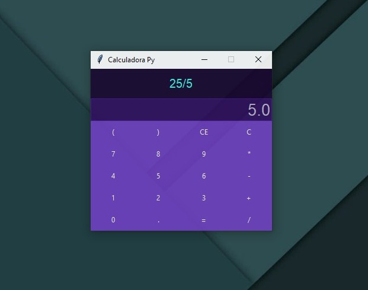

# Calculadora Py

Esta es una calculadora básica implementada en Python utilizando Tkinter y ttkbootstrap para la interfaz gráfica.



## Release 
- Este Proyecto tiene una Release compilada para windows
- Recomendacion si vas a usar la calculadora es mejor descargar el proyecyo y compilarlo por tu cuenta y no descargar la release porque no esta firmado ni nada `Salta antivirus`

## Funcionalidades

- Realiza operaciones básicas de suma, resta, multiplicación y división.
- Permite borrar el último carácter o limpiar por completo la pantalla de operaciones.
- Muestra la expresión actual y el resultado de las operaciones.

## Requisitos

- Python 3.x
- Tkinter (`tkinter` debe estar instalado por defecto en la mayoría de las distribuciones de Python).
- `ttkbootstrap`

## Ejecución

Para ejecutar la calculadora, simplemente corre el script principal `main.py`:

```
python main.py
```
